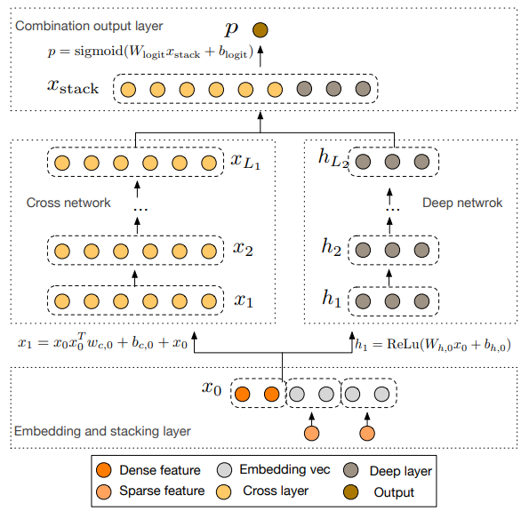
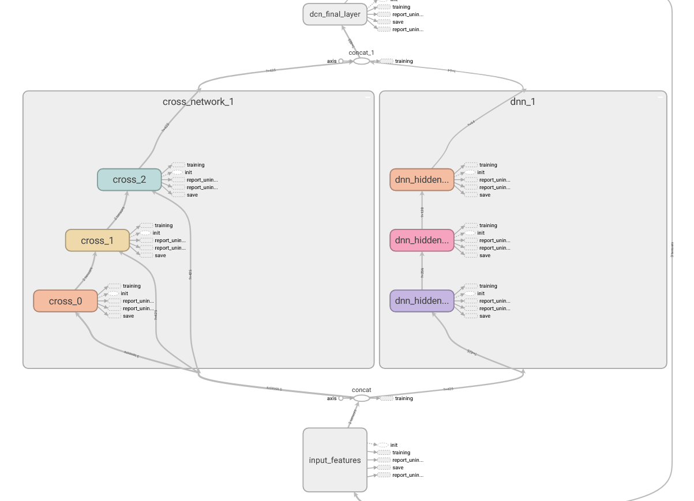

# DCN

Deep & Cross Network(DCN) 在 2017 年由 google 和 Stanford 共同发表的一篇论文中被提出，类似于 Wide & Deep Network(WDL)，是用复杂网络预估CTR的一种方法。

特征工程一直是许多预测模型成功的关键。许多有效的特征都来自于原始特征的交叉组合。在 WDL 中，wide 侧的交叉组合特征依然需要依靠 hand-craft 来完成。而 DCN 能对 sparse 和 dense 的输入自动学习特征交叉，可以有效地捕获有限阶（bounded degrees）上的有效特征交叉，无需人工特征工程或暴力搜索（exhaustive searching），并且计算代价较低。

论文地址：https://arxiv.org/abs/1708.05123

## 模型结构

## Tensorflow Graph 模型图

