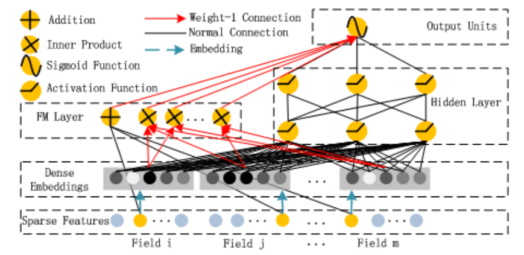
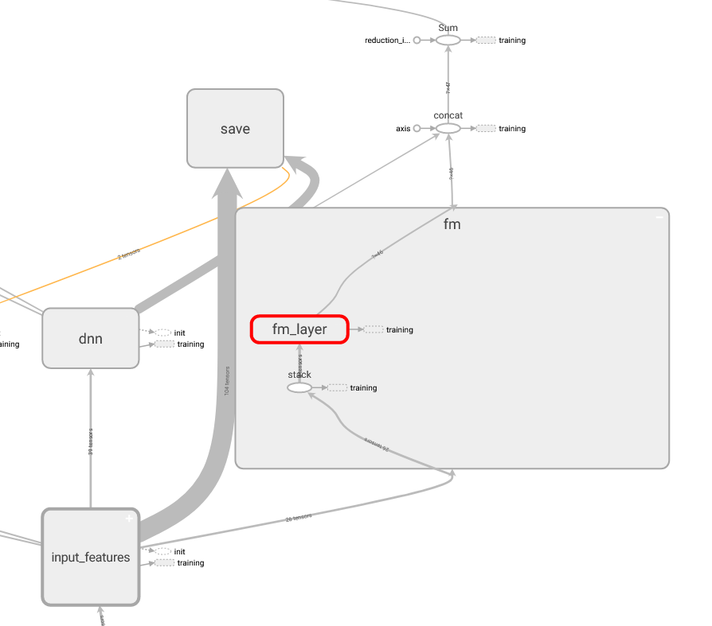

# DeepFM

DeepFM 模型在哈工大深圳与华为诺亚方舟联合实验室 2017 年发表的论文——《DeepFM: A Factorization-Machine based Neural Network for CTR Prediction》中首次提出。

该模型借鉴了 Wide & Deep 模型的结构，将 Wide 部分替换为 FM 模型，不再需要人工特征工程；并很巧妙地在FM的二阶部分和神经网络的 Embedding 层共享权重，减少了大量参数，提高训练速度。

论文地址：https://arxiv.org/abs/1703.04247

## 模型结构

## Tensorflow Graph 模型图

