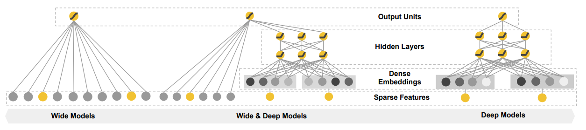
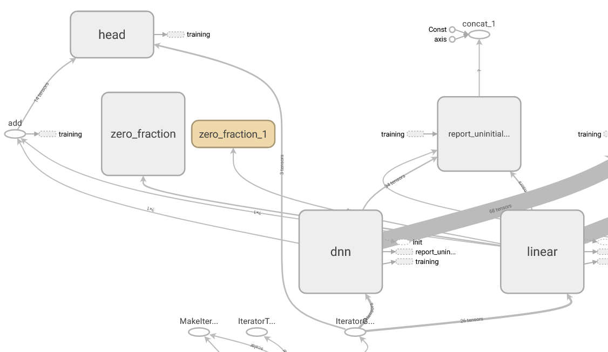

# Wide&Deep

Wide&Deep 是 Google 发表在 DLRS 2016 上的文章《Wide & Deep Learning for Recommender System》。Wide & Deep 模型的核心思想是结合线性模型的记忆能力和 DNN 模型的泛化能力，从而提升整体模型性能。Wide & Deep 已成功应用到了 Google Play 的app推荐业务，并于TensorFlow中封装。

论文地址：https://arxiv.org/abs/1606.07792

## 模型结构

## Tensorflow Graph 模型图

